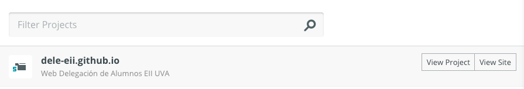
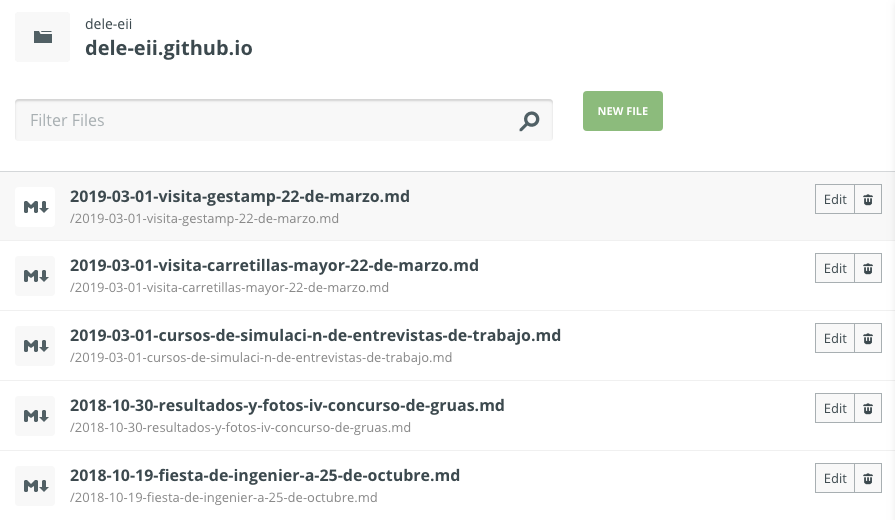
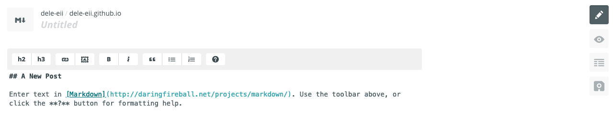
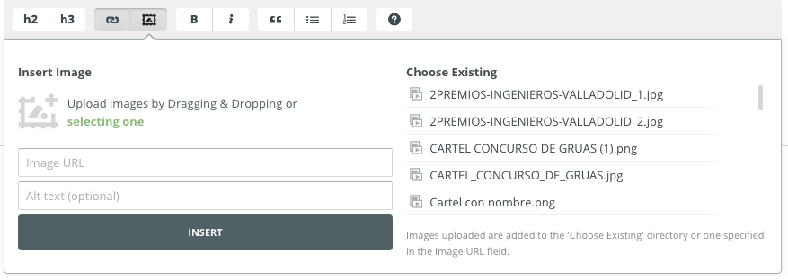
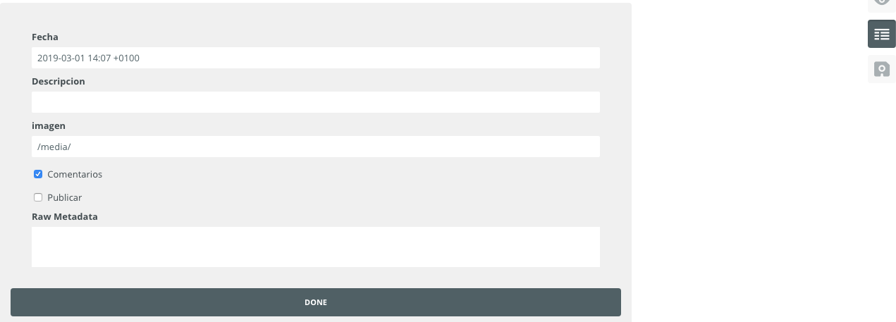
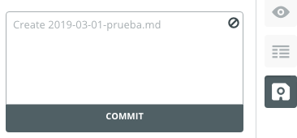
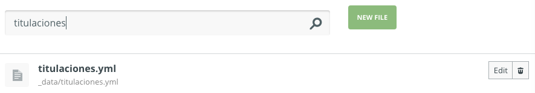
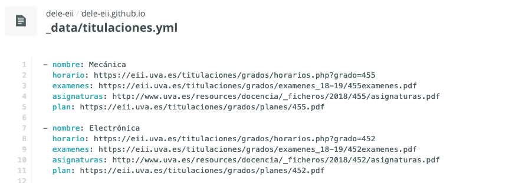
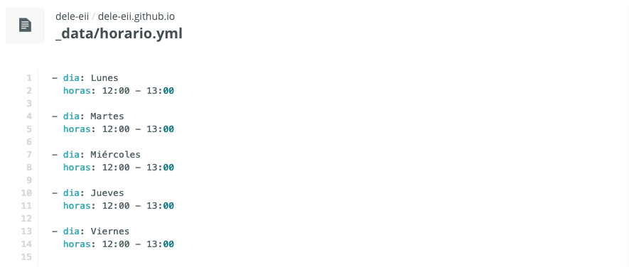

# Guia Pagina Web Delegacion

## Introdución 

En este documento resumire como usar la web y como esta construida, con el fin de poderla usar facilmente y dejar todo documentado para si en el futuro se tuviera que modificar.

Hay dos elementos fundamentales en toda pagina web, el dominio y el hosting.

El dominio en nuestro caso es [alumnos.eii.uva.es](alumnos.eii.uva.es) y esta gestionado por la universidad por lo que cualquier cambio respecto al dominio requiere contactar con ellos.

El hosting no es otra cosa que el ordenador donde esta alojado el codigo de la web y que te lo manda para que lo veas en tu navegador.

En nuestro caso usamos [GitHub](github.com) que es un sitio para subir proyectos que usan codigo y poder compartirlos y trabajar conjuntamente en ellos.

Este sitio ofrece poder crear una pagina web sencilla y gratis para cada proyecto usando [GitHub Pages](https://pages.github.com/).

## Noticias

Aqui contare todo lo relacionado con como subir y editar noticias a la web.

### Prose

Las noticias se crean desde una pagina llamada [prose.io](https://prose.io) donde nos pedira conectarnos con GitHub, la cuenta de Github debe ser la de la delegacion.

Una vez dentro nos aparecera un unico proyecto, en el que debemos entrar.



Dentro se encuentran todas las noticias de la web ordenadas cronologicamente.



Se puede editar cada noticia pulsando en "edit", borrala pulsando en la papelera o crear una nueva en "new file".

#### Creacion o edición de una noticia

Una vez dentro de una noticia se vera esta pantalla.



Donde pone "Untilted" se debera escribir el titulo de la noticia.

En el lateral derecho se ven cuatro elementos:

- lapiz: modo actual, para editar las noticias
- ojo: modo para previsualizar como se veria la noticia en la pagina (no funciona del todo bien)
- metadatos: saca un desplegable para modificar otros datos de la noticia como la descripcion o fecha, lo explico mas adelante.
- guardar: para guardar las noticias.

Por ultimo, la parte central es el editor donde se escribe la noticia en si.

El editor usa el lenguaje [Markdown](http://daringfireball.net/projects/markdown/) para escribir, este lenguaje es muy sencillo de aprender y ademas el editor tiene en la barra los elementos principales que se usan y una guia entera en la interrogacion.

[Markdown](http://daringfireball.net/projects/markdown/) ademas acepta codigo html para hacer cosas mas complejas. En esta guia se dejaran ejemplos de codigo html para simplemente tener que copiar y cambiar los datos.

#### Imagenes

Para subir imagenes a las noticias se debe pulsar en: 



Se pueden subir imagenes arrastrandolas o pulsando en "select one".

Antes de subir cualquier imagen se debe comprobar cuanto ocupa esta y evitar subir fotos de mucha resolucion.

Las imagenes se pueden comprimir usando [imagecompressor.com](https://imagecompressor.com/es/) o cualquier otro compresor en linea.

Si se quieren compartir varias imagenes y en buena calidad se puede usar un album de google fotos y poner el enlace en la noticia.

#### Metadatos y publicacion de una noticia

Una vez escrita una noticia se deben modificar los metadatos pulsando en el panel de la derecha.



- fecha: se puede modificar la fecha de una noticia, esto afectara al orden con el que aparece en la pagina. Por defecto pone la fecha de creacion de la noticia.
- Descripcion: Se debe escribir una breve descripcion de la noticia, si es un evento esta bien poner la fecha, lugar...

> Se puede contolar el salto de linea en las descripciones con la etiqueta html \<br>, ejemplo:  
> Fecha: 22 \<br>Lugar: aula b1  
> Resultado:  
> Fecha: 22  
> Lugar: aula b1

- Imagen: Se debe poner una imagen de la noticia, para ello se subira una imagen como se explico en el apartado anterior y copiar la ruta media/nombre_imagen.jpg que se pegara en este apartado.  
La imagen que se use aqui debe ser de proporciones mas o menos cuadradas y preferiblemnete mas larga que ancha.
- Comentarios: marcar si se quieren habilitar los comentarios en esa noticia.
- Publicar: marcar si se quiere que la noticia aparezca en la pagina.
- Raw Metadata: no usar.

Acabar pulsando en "DONE" y a continuacion pulsar en guardar.



Aparecera esta ventana y se debe pulsar en "COMMIT", con esto tu noticia estara subida al servidor y si marcaste la opcion de publicar en unos minutos se procesara y aparecera en la pagina.

### Estructuras HTML utiles

Acontinuación pondre algun codigo html y como se puede usar.
Tambien podeis entrar en la edicion de noticias ya subidas y ver como estan hechas.

#### Dos columnas

```
<div class="row">
<div class="col-12 col-sm-6">
	Contenido columna 1
</div>
<div class="col-12 col-sm-6">
	Contenido columna 2
</div>
</div>
```
En moviles la primera columna aparecera encima y la segunda debajo.

#### Documentos y formularios embebidos

```
<iframe src="url del archivo"
width="100%" height="1000" frameborder="0" 
marginheight="0" marginwidth="0">Cargando...</iframe>
```

La url del archivo depende del tipo de archivo:

- Un formulario de google sera la url de cuando se va al formulario mas "?embedded=true". Ejemplo:  
https://docs.google.com/forms/d/e/1FAIpQLSeNuB_5y2G75b2wrX2B2Yk-FKl1_o4dwbD_dN19I_GBZ90x6w/viewform?embedded=true

- Un pdf se debe subir primero a la pagina, igual que se suben las imagenes y poner:  
https://docs.google.com/viewer?url=alumnos.eii.uva.es/media/NOMBRE_ARCHIVO.pdf&amp;embedded=true

- Un video de youtube quedaria:

```
<iframe width="100%" height="500"
src="https://www.youtube.com/embed/ZwvPXxOe7cw">Cargando...</iframe>
```

#### Estilos

Se pueden aplicar estilos usando html y css, este es un ejemplo para centrar todo el texto de la noticia:

```
<style>
p{
text-align: center;
}
</style>
```

## Datos de las titulaciones y horario atención

Los datos se guardan en archivos .yml que usan YAML lo que permite almacenar datos de una manera muy sencilla y clara.

Para modificar los datos se debe buscar el archivo en prose, este normalmente solo muestras los archivos de las noticias pero si se usa el buscador se puede aceder a cualquier archivo, se deben modificar solo los archivos que conozcamos que hacen.



Los archivos que nos interesan son titulaciones.yml y horario.yml.

una vez dentro del archivo:



Se puede ver que la estructura es muy simple.

Para actualizar los datos de un año a otro basta con modificar las urls. Se puede comprobar cuales son las nuevas en la pagina de la escuela pero normalmente algunas no cambian y otras solo cambia un numero que indica el año, lo cual hace mas sencillo modificar todo.

Si se elimina todos los datos de una titulación esta desaparece de la web.

El archivo de horario funciona igual.



Si se elimina un dia este desaparece, si se borra todo la tabla entera desaparecera.

## Comentarios

[Disqus](https://disqus.com/) se usa para gestionar los comentarios de las noticias.

La delegación tiene una cuenta donde se puede ver todos los comentarios y moderarlos.

## Google Analytics

[Google Analytics](https://analytics.google.com/analytics/web) nos permite medir las visitas y el impacto de la web.

# Avanzado

De aqui en adelante solo leer si se quiere entender mejor como esta construida la pagina o si se quieren hacer grandes cambios y se sabe lo que se hace.

## GitHub

Aqui es donde esta subido todo el codigo de la web. El repositorio es publico y se puede visitar en este enlace https://github.com/dele-eii/dele-eii.github.io solo la cuenta de GitHub de la delegacion puede modificar el codigo.

GitHub ademas de usarse para compartir y trabajar conjuntamente en codigo tiene un control de versiones, eso quiere decir que cada modificacion se guarda y se puede ver o revertir. 

Nuestra pagina es una pagina estatica que esta disponible gracias a [GitHub Pages](https://pages.github.com/) y todos los cambios del codigo son procesados gracias a que GitHub incluye [Jekyll](https://jekyllrb.com/).

## Stack

Aqui explicare todas las tecnologias utilizadas en esta web.

Para empezar a comprender el resto es necesario saber usar html y css.

### Jekyll

Esta herramienta nos permite crear una pagina usando:

- html con Liquid para poder reutilizar partes de la pagina y crear plantillas.
- Sass para el procesar los estilos.
- Markdown para escribir noticias de manera facil y que se procese a html. 
- YAML para guardar datos.

[Jekyll](https://jekyllrb.com/) es la estructura basica de la web asi que si se quiere hacer cualquier cambio es necesario conocerla, es facil y en su web esta bastante bien explicado.

### Bootstrap 4

[Bootstrap](https://getbootstrap.com/) nos da un paquete de estilos para construir paginas web de manera mas rapida, sencilla y que sean adaptables a cualquier dispositivo.

Si se quieren crear nuevos elementos o modificar los existentes se debe conocer esta herramienta, es muy sencilla, en su web tienen un glosario de todos los elementos que se pueden usar y como se utilizan.

### AddThis

[AddThis](https://www.addthis.com/) se usa para los botones de compartir las noticias en redes sociales.


